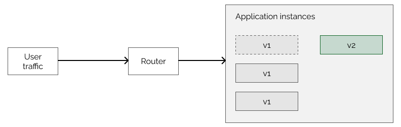

# [部署策略](https://www.baeldung.com/ops/deployment-strategies)

DevOps概念

定义

1. 概述

    部署的目的是在不停机和不影响用户体验的情况下安装或升级应用程序。无论何时部署应用程序，我们都必须仔细规划流程。特别是，我们需要考虑不同方面以及部署如何影响用户体验。为了方便起见，我们将这些考虑因素归类为所谓的部署策略，这些策略规定了如何进行升级。

    在本教程中，我们将介绍六种最常见的部署策略。

2. 部署策略

    简而言之，部署策略决定了应用程序或其他产品应如何实时发布到生产中。

    具体来说，部署策略可能因不同的原因而需要：

    - 界面变化
    - 性能
    - 互联性
    - 升级
    - 连续性

    上述所有因素以及更多因素都会推动部署战略的形成过程。

3. 重新创建部署战略

    我们讨论的最基本策略称为重新创建部署策略。顾名思义，我们停止并重新创建应用程序。新创建的部署会运行应用程序的更新版本。

    用户会经历一些停机时间，因为我们需要在新版本运行前停止应用程序。当原始版本关闭而新版本启动时，应用程序将不可用。

    另一方面，这种策略通常很容易设置：

    - 无需同时管理两个不同版本的应用程序
    - 所有用户都能立即使用更新后的应用程序

    不过，一个主要的缺点是，如果新版本在应用程序中引入了错误，用户就会立即接触到这些错误，而没有简单的恢复方法。因此，如果我们决定回滚，可能会导致更多的停机时间。要恢复部署，我们需要停止更新的应用程序，然后重新创建原来的应用程序，这与升级相同。

    总之，这种部署策略的设置和管理相当简单，但我们需要考虑其缺点。

4. 红-黑和蓝-绿部署

    接下来的两种策略有时被认为是相同的。事实上，它们有时是一样的。不过，它们之间也会有细微的差别。

    不过，无论哪种情况，我们都会为不同的应用程序版本分配不同的颜色，这就是名称的由来。

    1. 红-黑

        在这种部署策略中，原来的旧版本称为红色环境，新的更新版本称为黑色环境。

        最初，我们有红色环境。这是一个处理所有用户流量的现有应用程序。我们希望在不停机的情况下更新应用程序。为此，我们创建了一个几乎完全相同的环境。但有一点不同：新环境包含更新后的应用程序版本。

        现在，两个环境都在运行应用程序，但用户仍主要或完全使用旧版本。

        因此，我们可以启动新的黑色版本，但用户仍在红色环境中。下一步是切换到黑色环境，将所有用户流量转移到黑色环境。这种切换可以很快完成，因此用户不会出现停机。此外，用户可以像以前一样使用应用程序，他们可能不知道自己的请求现在是由更新后的应用程序提供的。

    2. 蓝-绿

        在这种有时几乎相同的策略中，旧版本是红色的，而新版本是黑色的。

        除了术语上的区别外，蓝绿部署和红黑部署的主要区别在于重定向请求的百分比。

        详细说来，虽然每个版本都包含一个实例，但由于可以使用它们的客户端很多，我们只能选择将请求部分定向到每个实例。

        换句话说，蓝绿部署可以执行负载平衡，以检查新版本的运行情况。相比之下，红-黑部署在任何给定时间点通常只使用其中一个或另一个部署。

    3. 回滚

        无论哪种方式，我们都可以看到蓝绿和红黑部署在正常运行时间和回滚能力方面更胜一筹。如果我们需要回滚更改，可以立即将流量路由到原始的蓝色或红色环境。

        相反，当部署准备就绪且我们不想回滚时，我们可以删除旧的蓝色或红色环境。然后，我们将更新版本从绿色重命名为蓝色，或从黑色重命名为红色。下一个版本也可以遵循同样的程序。

    4. 缺点

        不过，这些策略也有缺点。它们需要更多的资源，因为我们要创建两个几乎完全相同的环境。这样的设置既昂贵又耗时。此外，如果新版本做出了一些不向后兼容的更改，我们可能会遇到回滚问题。例如对数据库的更改。

        值得注意的是，正如我们后面所看到的，这些策略类似于其他两种方法之间的合并。

5. 滚动更新

    下一个策略是滚动更新。它只适用于应用程序有多个实例的情况。

    最初，所有实例都运行旧版本，而且所有实例都能处理用户请求。这一点很重要，因为进程会移除实例，而剩余的实例必须能够为用户提供服务，以防止停机。如果应用程序一开始只有一个实例，那么这种策略就变成了基本的重新创建或蓝绿部署。

    要执行滚动更新，我们首先要创建一个运行更新版本的应用程序新实例。当这个新实例启动时，我们将其视为应用程序的一部分，因此用户请求可能已由它处理：

    

    之后，我们将删除运行旧版本的一个实例。这样，我们就有多个运行旧版本的实例和一个运行更新版本的实例。这表明，如果要使用这种部署策略，我们必须能够同时支持不同的版本。否则，新旧实例可能无法按预期运行。换句话说，互操作性是关键。

    在此过程中，我们将继续添加更多运行新版本的实例，并移除旧版本：

    

    当最后一个实例被替换为更新的实例时，部署就完成了，我们要确保应用程序能按预期运行。当然，我们也可以在更新过程中进行测试。如果发现任何问题，我们可以回滚所有更改。

    这种部署策略可以参数化，以更好地满足当前需求。我们通常可以设置一次要更新多少个实例。可以不止一个，尤其是对于大型部署。

6. 金丝雀部署

    我们研究的下一种部署方法称为金丝雀部署。其主要思想是通过迭代将更新部署给越来越多的用户。

    最初，只有一小部分用户会收到更新。在这一步之后，我们会对系统进行测试，以确保应用程序在更改后能正常运行。这样，我们就可以降低风险，即使我们在系统中引入了错误，也只有一小部分用户会看到。

    确保更新成功后，我们就可以继续向所有用户推广。这也可以是渐进式的，也就是说，更新会逐渐覆盖越来越多的用户。例如，25%、50%、75%，然后才是 100%。我们甚至可以在每个增量之间重新测试系统：

    

    在测试过程中，我们可能会发现应用程序无法正常工作。在这种情况下，我们可以回滚更改，与前面的例子类似。

    金丝雀部署提供了高水平的控制，但这可能很难实现。我们需要确保只有有限数量的用户收到更新。与我们只需将流量从一个环境切换到另一个环境的蓝绿部署相比，这更具挑战性。另一方面，这也为我们提供了更大的灵活性并降低了风险。

    这个过程不需要像蓝绿部署那样多的资源，因为我们不需要重复环境。不过，如果新的应用程序版本对数据库进行了一些破坏性更改，我们也会面临同样的问题。

    金丝雀部署策略还涉及另一个有趣的方面。我们需要选择首先获得更新的目标受众。理想情况下，他们是会报告更新中出现的任何问题的目标群体。不过，我们也可以根据人口统计、物理位置、设备类型等因素来选择用户。

7. A/B 测试

    A/B 测试与金丝雀部署非常相似。它可以被视为其变体。

    这个过程向一个用户子集部署更新，就像金丝雀部署一样。不过，A/B 测试主要是为了从用户那里获得对我们所作更改的反馈。

    一部分用户继续使用应用程序的 A 版本，而另一部分用户则使用 B 版本：

    

    我们的目标是决定是否向所有用户推出更新。这可能是一个复杂的过程。我们应该考虑应用程序性能等技术方面的问题，但也可能希望从用户那里获得反馈，了解他们是否喜欢这些更改。例如，通过 A/B 测试，我们可以衡量如果更换按钮上的文字，用户是否更有可能点击该按钮。

    顾名思义，A/B 部署并不总是与升级有关，也可以是功能测试。

8. 影子部署

    影子部署与蓝绿部署类似，都是使用两个相同的环境。其中一个是原始生产环境，另一个是影子环境。

    然而，影子部署与之前的部署策略不同。在所有其他方法中，用户请求由更新后的环境提供。当我们使用影子部署时，两个环境都会接收请求，但响应来自原始应用程序版本：

    

    换句话说，我们在生产阶段模拟新的更新环境，但不让用户从该环境获得请求响应。这样，我们就不会有在系统中引入错误的风险，同时还能在负载情况下监控和测试新版本。

    另一方面，进行两次部署的成本会很高，而且难以管理。此外，我们还需要确保新版本不会产生任何副作用。例如，如果我们处理付款，就需要在新环境中模拟付款服务，以避免向用户收取两次费用。

    当我们确保更新版本稳定后，它就可以取代旧版本，开始提供请求并发送响应。

9. 结论

    在本文中，我们介绍了什么是部署策略，还比较了一些不同的策略。

    在选择在特定系统中使用哪种部署策略之前，我们应考虑多个方面，并对可能的部署策略进行比较。
