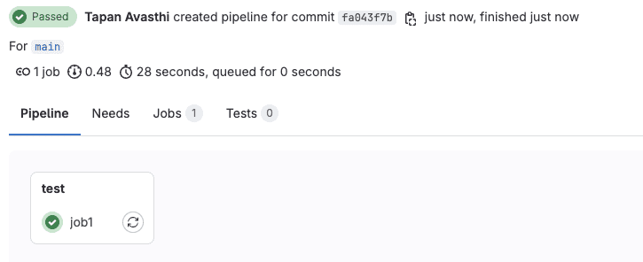
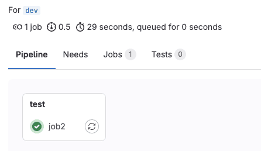
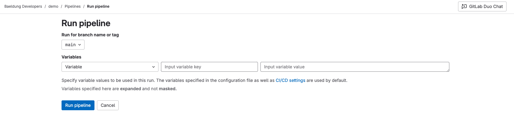
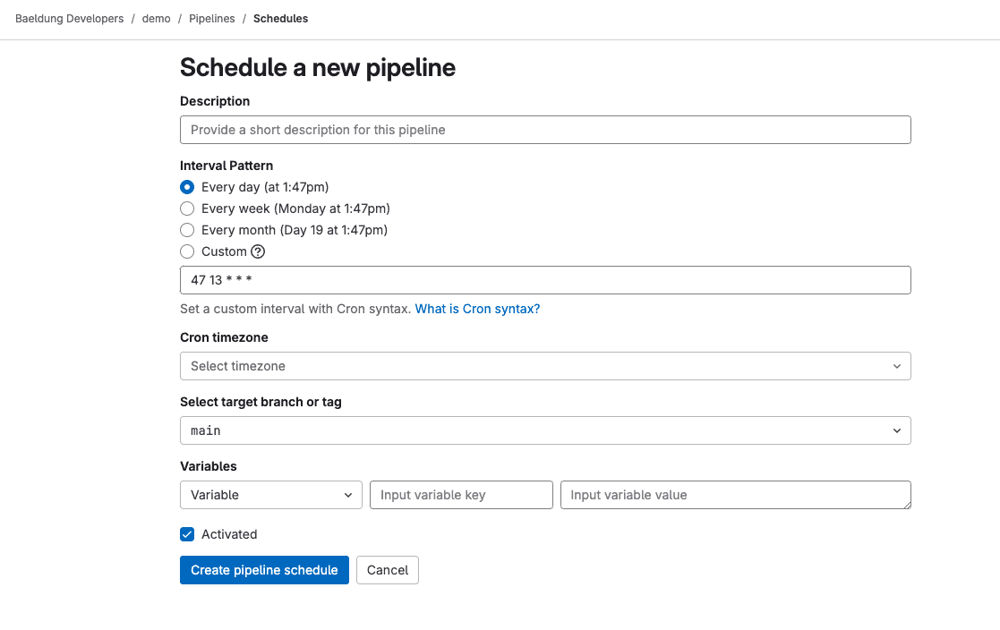
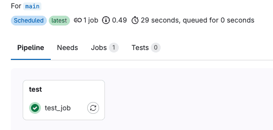
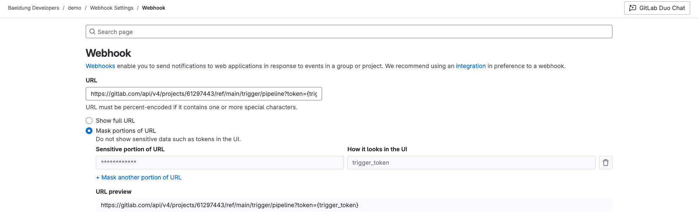
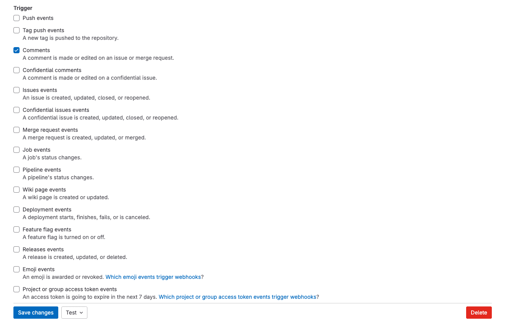
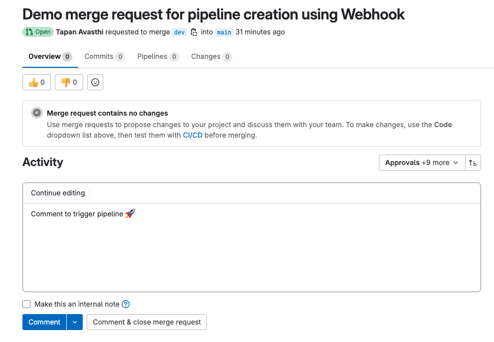
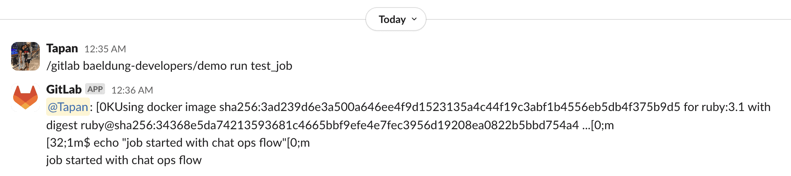

# [在同一个 GitLab 仓库中运行多个 CI/CD 流水线](https://www.baeldung.com/ops/gitlab-multiple-pipelines-same-repository)

部署工具    Git

GitLab

1. 概述
    在 GitLab 中，我们通过 `.gitlab-ci.yml` 配置文件定义项目的 CI/CD 流水线。由于**同一分支上不能存在多个 `.gitlab-ci.yml` 文件**，我们可能会疑惑是否可以在一个仓库中实现不同的 CI/CD 工作流。

    幸运的是，GitLab CI/CD 提供了丰富的灵活性和功能支持，让我们可以轻松地在同一个仓库中配置并运行多个流水线。

    在本教程中，我们将学习如何在一个 GitLab 仓库中运行多个 CI/CD 流水线。

2. 控制流水线与作业

    在这一部分，我们将了解 GitLab 使用的 [`workflow`](https://docs.gitlab.com/ee/ci/yaml/#workflow) 和 [`rules`](https://docs.gitlab.com/ee/ci/yaml/#rules) 关键字，它们用于控制何时创建流水线，以及哪些作业应该被包含在流水线中。

    1. 创建流水线

        我们来看一下位于 `baeldung-developers/demo` 项目主分支上的 `.gitlab-ci.yml` 文件：

        ```sh
        $ cat .gitlab-ci.yml
        hello_world:
        script:
            - echo "Hello, world!"
        ```

        每当有代码变更提交到主分支时，GitLab 就会自动创建一个流水线。该规则也适用于从主分支派生出的任何其他分支。

        让我们从主分支创建一个 dev 分支，并实际查看其效果：

        在一个开发者数量较多的项目中，会生成大量的流水线。这种行为可能是我们不希望看到的。因此，我们可以通过为流水线工作流定义规则来限制流水线的创建。

        接下来，我们使用 workflow 关键字添加一条规则，仅匹配项目的默认分支：

        ```sh
        $ cat .gitlab-ci.yml
        workflow:
        rules:
            - if: $CI_COMMIT_BRANCH == $CI_DEFAULT_BRANCH

        hello_world:
        script:
            - echo "Hello, world!"
        ```

        我们使用了 GitLab 为我们预定义的 CI_COMMIT_BRANCH 和 CI_DEFAULT_BRANCH 这两个 CI/CD 变量。

        最后，我们还可以添加多条规则，用于定义流水线的创建条件：

        ```yaml
        workflow:
        rules: 
            - <rule1>
            - <rule2>
            - <rule3>
        ```

        添加的多条规则，GitLab 会按顺序评估，直到找到匹配项为止；如果没有匹配项，则不会创建流水线。

    2. 创建作业

        与控制流水线创建类似，我们也可以使用 `rules` 来控制哪些作业应包含在流水线中。

        例如，定义两个互斥的作业 `job1` 和 `job2`：

        ```sh
        $ cat .gitlab-ci.yml
        job1:
        rules:
            - if: '$CI_COMMIT_BRANCH == $CI_DEFAULT_BRANCH'
        script:
            - echo "job started for the default branch"

        job2:
        rules:
            - if: '$CI_PIPELINE_SOURCE != $CI_DEFAULT_BRANCH'
        script:
            - echo "job started for a non-default branch"
        ```

        预期效果是：只有主分支执行 `job1`，而其他分支执行 `job2`。

        验证主分支流水线：

        

        再验证 dev 分支流水线：

        

        注意：每个有效的 GitLab 流水线必须至少包含一个作业。

        你可以根据实际需求组合多种规则，生成不同类型的流水线。

3. 使用 GitLab 用户界面（UI）

    默认情况下，GitLab 只为推送事件创建流水线。但我们可以通过设置规则启用其他触发方式。本节介绍如何通过 UI 手动运行流水线。

    1. 按需流水线（On-demand Pipeline）

        示例 `.gitlab-ci.yml` 文件如下：

        ```sh
        $ cat .gitlab-ci.yml
        workflow:
        rules:
            - if: $CI_PIPELINE_SOURCE == "web"

        test_job:
        script:
            - echo "job started with ui"
        ```

        GitLab 为这个流程设置了 `CI_PIPELINE_SOURCE=web`，因此我们添加了一条规则，以确保在此场景下创建流水线。

        现在，我们可以从 `<project>/Pipelines` 页面使用 “Run pipeline”（运行流水线）选项：

        

        你还可以自定义变量、选择要使用的分支或标签，从而根据规则运行不同的流水线。

        运行主分支流水线后查看结果。

    2. 定时流水线（Scheduled Pipeline）

        同样，我们需要在 `.gitlab-ci.yml` 中添加规则以启用定时流水线：

        ```sh
        $ cat .gitlab-ci.yml
        workflow:
        rules:
            - if: $CI_PIPELINE_SOURCE == "schedule"

        test_job:
        script:
            - echo "job started with schedule"
        ```

        在 GitLab 中，定时流水线的 `CI_PIPELINE_SOURCE` 值为 `"schedule"`。

        进入 *Pipeline schedules 页面* 创建一个新的定时任务：

        

        除了定义变量和分支/标签外，还需指定 [cron](https://www.baeldung.com/cron-expressions#cron-expression) 表达式。你可以在创建时激活该计划，或稍后编辑它。

        接下来，我们可以在 “Pipeline schedules” 页面上看到所有已创建的定时任务。

        可以看到下一次运行时间大约在 3 分钟内。

        等待约 3 分钟后，新的流水线会被触发：

        

        注意：GitLab 会为此类流水线添加 “Scheduled” 标签。

4. 使用 GitLab API 和 Webhook

    本节介绍如何通过 GitLab API 和 Webhook 创建流水线。

    1. 使用创建流水线 API（Create Pipeline API）

        `.gitlab-ci.yml` 示例：

        ```sh
        $ cat .gitlab-ci.yml
        workflow:
        rules:
            - if: $CI_PIPELINE_SOURCE == "api"

        test_job:
        script:
            - echo "job started with api flow"
        ```

        需要注意的是，在此流程中，GitLab 会将 `CI_PIPELINE_SOURCE` 设置为 `api`。

        接下来，让我们使用 `curl` 调用为 `baeldung-developers/demo` 项目的主分支创建流水线的 API：

        ```bash
        curl --request POST \
            --header "PRIVATE-TOKEN: <token>" \
            "https://gitlab.com/api/v4/projects/baeldung-developers%2Fdemo/pipeline?ref=main"
        ```

        我们使用了经过 URL 编码的项目路径字符串。此外，我们需要将 `<token>` 替换为项目的访问令牌。

        或者，我们也可以使用项目 ID 来代替项目路径调用该 API：

        ```bash
        curl --request POST \
            --header "PRIVATE-TOKEN: <token>" \
            "https://gitlab.com/api/v4/projects/61297443/pipeline?ref=main"
        ```

        替换 `<token>` 为你自己的访问令牌。

        查看 Pipelines 页面确认流水线已被创建，并带有 `"api"` 标签。

        太棒了！我们成功创建了一个由 API 触发的流水线。

    2. 使用触发流水线 API（Trigger Pipeline API）

        首先，我们在 `.gitlab-ci.yml` 中设置规则，以启用通过触发器（trigger）方式创建流水线的功能：

        ```sh
        $ cat .gitlab-ci.yml
        workflow:
        rules:
            - if: $CI_PIPELINE_SOURCE == "trigger"

        test_job:
        script:
            - echo "job started with trigger flow"
        ```

        现在，让我们使用 `curl` 调用该项目主分支的触发流水线（trigger pipeline）接口：

        ```bash
        curl -X POST \
            --fail \
            -F token=<trigger_token> \
            -F ref=main \
            https://gitlab.com/api/v4/projects/61297443/trigger/pipeline
        ```

        我们必须将 `<trigger_token>` 替换为流水线触发令牌。此外，GitLab 在触发端点中不接受经过 URL 编码的项目路径，因此我们只能使用项目 ID（project ID）。

        查看 Pipelines 页面确认流水线已创建，并带有 “trigger token” 标签。

    3. 使用 Webhook

        我们可以在 “Webhook” 页面上定义一个 Webhook 来触发流水线：

        

        有趣的是，GitLab 允许我们对端点中包含的敏感信息（如 `trigger_token`）进行掩码处理。

        此外，我们可以选择多个触发事件，但为了简单起见，我们只选择 “Comments”（评论）事件：

        

        接下来，我们需要访问一个 GitLab 的合并请求（merge request）或问题（issue），并添加一条新评论：

        

        需要注意的是，如果我们勾选了 “Make this an internal note”（将此设为内部备注）选项，GitLab 将不会触发流水线。

        最后，让我们访问 “Pipelines” 页面，以验证新创建的流水线。

        非常棒！我们成功通过 Webhook 触发了流水线。

5. 使用 GitLab ChatOps

    通过 [GitLab ChatOps](https://docs.gitlab.com/ee/ci/chatops/)，我们可以通过在 [Slack](https://slack.com/) 或 [Mattermost](https://mattermost.com/) 中发送斜杠命令（slash command），选择性地运行流水线中的独立作业。我们将以[集成 Slack](https://docs.gitlab.com/ee/user/project/integrations/gitlab_slack_application.html) 为例来演示这一场景。

    首先，我们来看一下在 `.gitlab-ci.yml` 中需要配置的规则，以启用通过 ChatOps 流程创建流水线：

    ```sh
    $ cat .gitlab-ci.yml
    workflow:
    rules:
        - if: $CI_PIPELINE_SOURCE == "chat"

    test_job:
    script:
        - echo "job started with chat ops flow"
    ```

    在这种场景下，GitLab 会将 `CI_PIPELINE_SOURCE` 设置为 `chat`。

    接下来，我们可以在与 GitLab 集成的 Slack 频道中发送一个斜杠命令：

    ```txt
    /gitlab baeldung-developers/demo run test_job
    ```

    查看 Pipelines 页面确认流水线正在运行。

    最后，当作业完成后，“GitLab” 应用会将作业的输出结果以及一些元数据信息作为回复发送回去：

    

    完美！我们成功通过 ChatOps 运行了流水线。

6. 总结

    在本文中，我们学习了如何在同一个 GitLab 仓库中运行多个 CI/CD 流水线。

    我们掌握了以下内容：

    - 使用 `workflow` 和 `rules` 控制流水线和作业的创建；
    - 通过 GitLab UI、API、Webhook 和 ChatOps 等多种方式触发流水线；
    - 利用 GitLab 提供的内置变量（如 `$CI_PIPELINE_SOURCE`）灵活控制流水线行为。

    无论你是想为不同分支、不同事件或不同用户操作定制流水线，GitLab 都提供了强大且灵活的支持。
