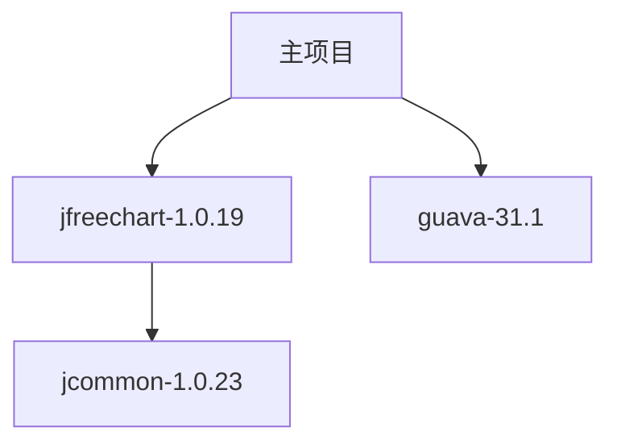

要实现所有构件都从您本地的Nexus仓库获取（完全隔离外部下载），您需要以下配置方案：

## 一、严格隔离模式配置步骤

1. **删除/禁用所有proxy类型仓库**
   - 进入Nexus控制台 → Repository → Repositories
   - 删除或停用所有类型为proxy的仓库（如maven-central等）

2. **创建严格的仓库组**
   - 确保您的仓库组（如maven-public）只包含：
     - 本地hosted类型仓库（存放您批准的构件）
     - 不包含任何proxy仓库

3. **修改Maven客户端配置**
   在项目的`pom.xml`或全局`settings.xml`中：
   ```xml
   <mirrors>
     <mirror>
       <id>nexus</id>
       <url>http://您的Nexus地址/repository/maven-public/</url>
       <mirrorOf>*</mirrorOf> <!-- 强制所有请求都走Nexus -->
     </mirror>
   </mirrors>
   ```

## 二、构件来源管理方案

### 方案A：手动上传必要构件
1. 通过管理界面上传：
   - 访问Nexus控制台 → Browse → 选择hosted仓库
   - 点击"Upload"按钮上传jar/pom文件

2. 使用mvn命令上传：
   ```bash
   mvn deploy:deploy-file \
     -DgroupId=org.jfree \
     -DartifactId=jfreechart \
     -Dversion=1.0.19 \
     -Dpackaging=jar \
     -Dfile=本地路径/jfreechart-1.0.19.jar \
     -Durl=http://您的Nexus地址/repository/maven-releases/ \
     -DrepositoryId=nexus
   ```

### 方案B：搭建导入管道（推荐）
1. 在隔离环境中：
   ```bash
   # 1. 在能访问外网的机器下载所需构件
   mvn dependency:get \
     -Dartifact=org.jfree:jfreechart:1.0.19 \
     -DremoteRepositories=central::default::https://repo.maven.apache.org/maven2

   # 2. 将~/.m2/repository下的构件上传到Nexus
   find ~/.m2/repository -name "*.jar" -exec \
     mvn deploy:deploy-file -Dfile={} \
     -Durl=http://您的Nexus地址/repository/maven-releases/ \
     -DrepositoryId=nexus \
     -DgeneratePom=true \;
   ```

## 三、严格模式验证方法

1. 测试下载：
   ```bash
   mvn clean package -U --settings=严格模式的settings.xml
   ```

2. 确认所有请求：
   - 只访问您的Nexus地址
   - 不尝试连接任何外部仓库（如repo.maven.apache.org）

## 四、高级管控建议

1. **防火墙规则**：
   - 禁止Nexus服务器访问外网
   - 只开放内部客户端访问Nexus的端口

2. **仓库策略**：
   ```xml
   <repository>
     <id>nexus</id>
     <url>http://您的Nexus地址/repository/maven-public/</url>
     <releases><enabled>true</enabled></releases>
     <snapshots><enabled>false</enabled></snapshots>
   </repository>
   ```

3. **Nexus权限配置**：
   - 创建专用部署账号
   - 禁用匿名访问
   - 启用内容校验（Settings → Security → Content Selector）

这样配置后，您的构建将100%依赖本地Nexus仓库，完全隔离外部网络，适合严格的安全合规要求场景。

要确保多个项目所需的所有构件都能导入到本地Nexus仓库，并实现完全自给自足的依赖管理，可以采用以下系统化方案：

---

### **一、基础构件收集方案**
#### 1. **通过POM文件批量导入**
```bash
# 在能访问外网的机器执行（需提前安装所有项目源码）
find /所有项目路径 -name "pom.xml" -exec mvn dependency:go-offline -f {} \;
```

#### 2. **导出所有依赖到本地目录**
```bash
mvn dependency:copy-dependencies -DoutputDirectory=./dependencies
```

#### 3. **批量上传到Nexus**
```bash
# 使用Nexus的API批量上传（需安装curl）
find ./dependencies -name "*.jar" | while read file; do
  curl -u 用户名:密码 --upload-file $file \
  "http://nexus地址/repository/maven-releases/$(echo $file | sed 's/\.\///')"
done
```

---

### **二、自动化同步系统（推荐）**
#### 1. **搭建中间同步仓库**


#### 2. **使用仓库同步工具**
```bash
# 使用nexus-cli工具同步特定group
nexus-cli sync --source https://repo.maven.apache.org \
               --target http://内部nexus/repository/maven-releases \
               --group org.jfree
```

---

### **三、严格依赖管控流程**
#### 1. **依赖清单管理**
```markdown
1. 创建dependency-list.csv文件包含：
   | GroupID       | ArtifactID  | Version | 来源项目 |
   |---------------|------------|---------|--------|
   | org.jfree     | jfreechart | 1.0.19  | 财务系统 |
   | com.google.guava | guava   | 31.1-jre | 所有项目 |
```

#### 2. **审核上传脚本**
```python
# upload_validation.py
import csv
with open('dependency-list.csv') as f:
    for row in csv.DictReader(f):
        if row['审批状态'] != '已批准':
            raise Exception(f"未批准的依赖: {row['GroupID']}:{row['ArtifactID']}")
```

---

### **四、验证完整性**
#### 1. **构建验证脚本**
```bash
#!/bin/bash
for project in /projects/*; do
  mvn -f "$project/pom.xml" dependency:resolve \
    -Dmaven.repo.local=/tmp/empty-repo \
    -s /path/to/strict-settings.xml || \
    { echo "$project 依赖缺失"; exit 1; }
done
```

#### 2. **Nexus完整性报告**
```sql
-- 查询缺失依赖
SELECT * FROM components WHERE 
  NOT EXISTS (
    SELECT 1 FROM assets 
    WHERE assets.component_id = components.id
  );
```

---

### **五、进阶方案：依赖预扫描系统**
1. **静态分析所有POM文件**
```java
// 使用Aether库扫描所有依赖
RepositorySystem system = newRepositorySystem();
DependencyRequest request = new DependencyRequest();
request.setCollectRequest(new CollectRequest(
    new Dependency(new DefaultArtifact("org.jfree:jfreechart:1.0.19"), "compile"));
system.resolveDependencies(session, request);
```

2. **生成依赖关系图**


---

### **六、灾备方案**
1. **定期仓库快照**
```bash
# 备份Nexus存储目录
tar -czvf nexus-backup-$(date +%F).tar.gz \
    /nexus-data/blobs/default/content/
```

2. **依赖镜像清单**
```xml
<!-- mirror-all.xml -->
<mirror>
  <id>nexus-all</id>
  <url>http://nexus/repository/maven-public</url>
  <mirrorOf>external:*</mirrorOf>
</mirror>
```

---

通过以上方案组合实施，可以实现：
1. 所有项目依赖的**全量覆盖**
2. 新依赖的**自动化发现**
3. 构件来源的**完整可追溯**
4. 系统间的**严格隔离**

建议配合CI系统设置门禁验证，确保任何构建都不会尝试从外部仓库下载依赖。