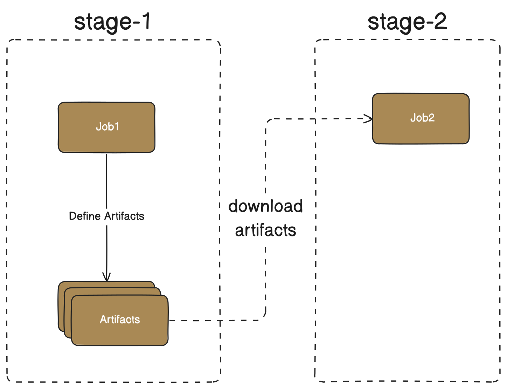

# [在 GitLab CI/CD 中将构建产物传递给下一阶段的指南](https://www.baeldung.com/ops/gitlab-pass-artifacts-stage-job)

DevOps

GitLab

1. 概述
    为了提高安全性、可靠性和效率，GitLab 在 [CI/CD](https://www.baeldung.com/ops/ci-cd-best-practices#overview) 流水线中对各个阶段和[作业](https://www.baeldung.com/ops/ci-cd-best-practices#overview)进行了隔离。每个作业都在一个全新的环境中运行，有助于减少作业之间的相互干扰。因此，在某一阶段中创建的文件**默认不会在其他阶段中直接可用**。

    在本教程中，我们将学习如何使用 **[artifacts](https://docs.gitlab.com/ee/ci/jobs/job_artifacts.html)（构建产物）** 将数据从一个阶段传递到另一个阶段。

2. 基础知识
    从根本上来说，从一个作业向另一个作业传递 artifacts 是一个两步过程：

    

    - 一个作业定义 artifacts；
    - 另一个作业下载这些 artifacts。

    这就意味着两个作业之间存在依赖关系：job2 的成功执行依赖于 job1 是否生成了所需的 artifacts。

3. dependencies 关键字

    GitLab 默认会让作业下载前一阶段所有作业产生的 artifacts。但是，我们可以使用 [dependencies](https://docs.gitlab.com/ee/ci/yaml/#dependencies) 关键字来控制这种行为。

    下面是一个 [.gitlab-ci.yml](https://www.baeldung.com/ops/gitlab-runner-guide#1-creating-agitlab-ciyml-file) 文件示例，其中包含三个作业，分别位于不同的阶段，并使用 [artifacts](https://docs.gitlab.com/ee/ci/yaml/#artifacts) 关键字定义了构建产物：

    ```yaml
    stages:
    - stage1
    - stage2
    - stage3

    job1:
    stage: stage1
    script:
        - echo "job1 - executing task1" > task1.txt
        - echo "job1 - executing task2" > task2.txt
    artifacts:
        paths:
        - task1.txt
        - task2.txt

    job2:
    stage: stage2
    script:
        - cat task1.txt
        - cat task2.txt
        - echo "job2 - executing task1" > task1.txt
        - echo "job2 - executing task2" > task2.txt
    artifacts:
        paths:
        - task1.txt
        - task2.txt

    job3:
    stage: stage3
    script:
        - cat task1.txt
        - cat task2.txt
    ```

    在这个例子中，job1 和 job2 都保存了 `task1.txt` 和 `task2.txt` 作为 artifacts。

    由于 job2 是在 stage2 执行的，它会先下载 job1 的 artifacts，然后覆盖它们。

    当 job3 在 stage3 执行时，它会下载之前所有阶段的 artifacts，但只能看到 job2 最新写入的 `task1.txt` 和 `task2.txt` 文件。

    我们可以通过 job3 的日志验证这一点：

    ```log
    Downloading artifacts
    00:01
    Downloading artifacts for job1 (8252551460)...
    Downloading artifacts from coordinator... ok        host=storage.googleapis.com id=8252551460 responseStatus=200 OK token=glcbt-66
    Downloading artifacts for job2 (8252551461)...
    Downloading artifacts from coordinator... ok        host=storage.googleapis.com id=8252551461 responseStatus=200 OK token=glcbt-66
    Executing "step_script" stage of the job script
    00:00
    Using docker image sha256:243309b48f4ab04a5de198e1ef7ec8b224aa96924f096f188dd6c616c3a71233 for ruby:3.1 with digest ruby@sha256:ba4d592a4fc6e3f5d2a9a52a1a3bbefde53308e786de4f66ba72237b18b15676 ...
    $ cat task1.txt
    job2 - executing task1
    $ cat task2.txt
    job2 - executing task2
    ```

    接下来，我们编辑 `.gitlab-ci.yml` 文件，为 job3 添加对 job1 的显式依赖：

    ```yaml
    # job1 和 job2 的定义与之前相同
    job3:
    stage: stage3
    dependencies:
        - job1
    script:
        - cat task1.txt
        - cat task2.txt
    ```

    通过 GitLab UI 查看流水线执行情况：虽然 job3 不再依赖 job2，但它仍然会在 job2 之后执行，因为 `dependencies` 关键字并不会改变作业的执行顺序。所有作业依然按照阶段顺序依次执行。

    最后查看 job3 的日志：

    ```log
    Downloading artifacts
    00:01
    Downloading artifacts for job1 (8252561668)...
    Downloading artifacts from coordinator... ok        host=storage.googleapis.com id=8252561668 responseStatus=200 OK token=glcbt-66
    Executing "step_script" stage of the job script
    00:01
    Using docker image sha256:243309b48f4ab04a5de198e1ef7ec8b224aa96924f096f188dd6c616c3a71233 for ruby:3.1 with digest ruby@sha256:ba4d592a4fc6e3f5d2a9a52a1a3bbefde53308e786de4f66ba72237b18b15676 ...
    $ cat task1.txt
    job1 - executing task1
    $ cat task2.txt
    job1 - executing task2
    Cleaning up project directory and file based variables
    00:00
    Job succeeded
    ```

    可以看到，job3 没有下载 job2 的 artifacts，因为我们只指定了对 job1 的依赖。

4. needs 关键字

    尽管我们可以使用 `dependencies` 控制 artifacts 的下载行为，但作业的执行顺序仍然严格遵循阶段顺序。而使用 [needs](https://docs.gitlab.com/ee/ci/yaml/#needs) 关键字可以创建一个无环依赖图（acyclic dependency graph），从而提升整体执行效率。

    下面是使用 `needs` 改进 `.gitlab-ci.yml` 的示例：

    ```yaml
    stages:
    - stage1
    - stage2
    - stage3

    job1:
    stage: stage1
    needs: []
    script:
        - echo "job1 - executing task1" > task1.txt
        - echo "job1 - executing task2" > task2.txt
    artifacts:
        paths:
        - task1.txt
        - task2.txt

    job2:
    stage: stage2
    needs: ["job1"]
    script:
        - echo "job2 - executing task1" > task1.txt
        - echo "job2 - executing task2" > task2.txt
    artifacts:
        paths:
        - task1.txt
        - task2.txt

    job3:
    stage: stage3
    needs: ["job1"]
    script:
        - cat task1.txt
        - cat task2.txt
    ```

    我们在 job2 和 job3 中使用 `needs` 明确指定对 job1 的依赖。这样即使 job2 和 job3 处于不同阶段，也可以**并行执行**。

    通过 GitLab UI 查看流水线运行情况：整个流水线耗时 1 分 6 秒，明显少于使用 `dependencies` 的 1 分 35 秒。需要注意的是，计费用的计算时间仍然是各作业执行时间的总和，即使是并行执行。

    最后检查 job3 的日志，确认它仅下载了 job1 的 artifacts：

    ```log
    Downloading artifacts
    00:01
    Downloading artifacts for job1 (8252613758)...
    Downloading artifacts from coordinator... ok        host=storage.googleapis.com id=8252613758 responseStatus=200 OK token=glcbt-66
    Executing "step_script" stage of the job script
    00:01
    Using docker image sha256:243309b48f4ab04a5de198e1ef7ec8b224aa96924f096f188dd6c616c3a71233 for ruby:3.1 with digest ruby@sha256:ba4d592a4fc6e3f5d2a9a52a1a3bbefde53308e786de4f66ba72237b18b15676 ...
    $ cat task1.txt
    job1 - executing task1
    $ cat task2.txt
    job1 - executing task2
    Cleaning up project directory and file based variables
    00:00
    Job succeeded
    ```

    太棒了！我们成功实现了这一目标。

5. 使用 API 下载 Artifacts

    我们还可以使用 GitLab 的 [Job Artifacts API](https://docs.gitlab.com/ee/api/job_artifacts.html) **显式下载 artifacts**，并通过设置 `needs: artifacts: false` 来禁用自动下载。这样可以获得更细粒度的控制，包括作业执行顺序和 artifacts 的下载时机。

    以下是一个 `.gitlab-ci.yml` 示例，展示了 job3 如何从 job1 和 job2 下载 artifacts：

    ```yaml
    stages:
    - stage1
    - stage2
    - stage3

    job1:
    stage: stage1
    needs: []
    script:
        - echo "job1 - executing task1" > task1.txt
        - echo "job1 - executing task2" > task2.txt
    artifacts:
        paths:
        - task1.txt
        - task2.txt

    job2:
    stage: stage2
    needs: []
    script:
        - echo "job2 - executing task1" > task1.txt
        - echo "job2 - executing task2" > task2.txt
    artifacts:
        paths:
        - task1.txt
        - task2.txt

    job3:
    stage: stage3
    needs: 
        - job: job1
        artifacts: false
        - job: job2
        artifacts: false
    script: |
        for job in job1 job2
        do
            curl --silent --location --output artifacts_job1.zip \
            "https://gitlab.com/api/v4/projects/$CI_PROJECT_ID/jobs/artifacts/$CI_COMMIT_BRANCH/download?job=$job&job_token=$CI_JOB_TOKEN"
            unzip -o artifacts_job1.zip
            cat task1.txt
            cat task2.txt
        done
    ```

    我们使用 GitLab 的预定义变量（如 `$CI_PROJECT_ID`、`$CI_COMMIT_BRANCH` 和 `$CI_JOB_TOKEN`）构造了 API 请求地址。

    查看 job3 的日志，确认两个 artifacts 都被正确下载：

    ```log
    ...
    Archive:  artifacts.zip
    inflating: task1.txt               
    inflating: task2.txt               
    job1 - executing task1
    job1 - executing task2
    Archive:  artifacts.zip
    inflating: task1.txt               
    inflating: task2.txt               
    job2 - executing task1
    job2 - executing task2
    Cleaning up project directory and file based variables
    00:00
    Job succeeded
    ```

    完美！正如预期一样工作。

6. 总结

    在本文中，我们探讨了多种在 GitLab CI/CD 流水线中将 artifacts 传递到下一阶段的方法。我们学习了最常用的几个关键字：

    - `artifacts`：用于定义要保留的构建产物；
    - `dependencies`：用于控制哪些作业的 artifacts 应该被下载；
    - `needs`：用于定义作业之间的依赖关系，并支持并行执行。

    此外，我们还演示了如何使用 GitLab API 显式下载 artifacts。
