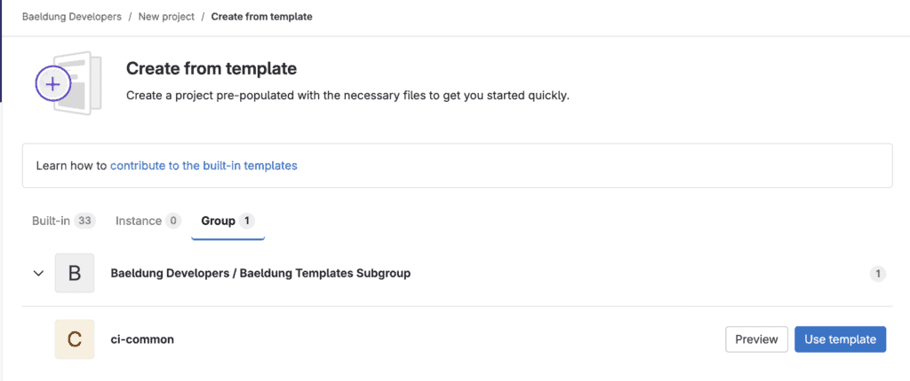

# [在多个项目之间共享 GitLab CI/CD 配置](https://www.baeldung.com/ops/gitlab-share-ci-cd-config-multiple-projects)

部署工具    DevOps

GitLab  

1. 概述
    [持续集成（CI）和持续交付（CD）](https://www.baeldung.com/cs/continuous-integration-deployment-delivery)有助于确保代码质量与安全性、自动化测试，并简化部署流程。然而，随着项目的增多，在多个仓库中维护多个 CI 配置变得繁琐且容易出错。

    在本教程中，我们将学习如何通过在多个项目之间共享 YAML 配置，高效地管理 GitLab CI/CD 配置。

2. 定义自定义 CI/CD 配置
    让我们首先查看位于 `baeldung-developers` GitLab 组下的 `ci-common` 项目中的 `.gitlab-ci.yml` 配置文件：

    ```bash
    $ cat .gitlab-ci.yml
    hello_world:
    script:
        - echo "Hello, world!"
    .greeting:
    script:
        - echo "$GREETING"
    ```

    GitLab CI/CD 不会处理 `.greeting` 作业，除非我们使用一个普通作业对其进行扩展。

    现在，我们可以通过使用相应项目 CI/CD 设置下的自定义 CI/CD 配置选项，从 `ci-common` 项目中重用流水线配置：

    ```text
    <filepath>[@<full group path>/<project path>][:refname]
    ```

    如果文件属于当前项目，我们可以省略路径中的组和项目信息。此外，只有当文件位于非默认分支时，才需要指定 `refname`。

    现在，让我们为示例项目 `proj-use-custom-ci-config` 自定义此设置：

    

    最后请注意，这种方法的简便性是以可扩展性和可见性为代价的，因为我们必须原样使用该配置，而无法灵活修改它。

3. 使用自定义组级项目模板
    我们可以使用 GitLab 的[自定义组级项目模板](https://docs.gitlab.com/ee/user/group/custom_project_templates.html)，在创建新项目时预定义 CI/CD 配置。但是，该功能仅适用于 GitLab Premium 和 Ultimate 订阅版本。

    对于此方法，我们必须在一个专门用于存储模板的子组下定义所有项目模板。因此，我们在“Baeldung Developers”组下定义了“Baeldung Templates Subgroup”。

    现在，我们可以在 “Baeldung Developers” 组的设置中定义用于模板的子组：

    

    接下来，我们在 “Baeldung Templates Subgroup” 子组下创建 `ci-common` 项目，并使用前面提到的 `.gitlab-ci.yml` 配置文件。

    然后，我们可以使用 “Create from template(从模板创建)” 选项来创建具有预定义配置的新项目：

    

    最后，我们需要提供必要的详细信息，例如 “Project name” 和 “Template”，以创建新项目。

    我们已成功从现有模板项目中重用了 CI/CD 配置。尽管如此，请注意对模板所做的任何未来更改都不会反映在使用它们的项目中。

4. 包含静态 YAML 文件
    在本节中，我们将了解 [`include`](https://docs.gitlab.com/ee/ci/yaml/includes.html) 和 [`trigger`](https://docs.gitlab.com/ee/ci/yaml/#trigger) 关键字以及如何共享静态 GitLab CI/CD 配置文件。

    1. 增强项目流水线
        让我们在示例项目 `proj-include-static-yaml` 中定义 `.gitlab-ci.yml` 配置文件：

        ```bash
        $ cat .gitlab-ci.yml
        include:
        - project: baeldung-developers/ci-common
            file: .gitlab-ci.yml
        ```

        我们使用了 `include` 关键字，并引用了 `ci-common` 项目中的 `.gitlab-ci.yml` 文件。

        正如预期，我们可以看到 `hello_world` 作业正在运行。

        此外，我们还可以通过添加新的定义来修改或扩展我们的 CI/CD 配置：

        ```sh
        $ cat .gitlab-ci.yml
        include:
        - project: baeldung-developers/ci-common
            file: .gitlab-ci.yml

        hello_world:
        script:
            - echo "Hello, world! (modified)"
        ```

        GitLab 使用 “closest scope wins” 的算法来解析冲突的键并生成有效的 YAML 配置。

        接下来，验证本地定义的 `script` 是否优先于外部定义：

        ```bash
        Executing "step_script" stage of the job script
        ...
        $ echo "Hello, world! (modified)"
        Hello, world! (modified)
        ...
        Job succeeded
        ```

        最后，编写 `hello_world_greeting` 作业，它[扩展](https://docs.gitlab.com/ee/ci/yaml/#extends)了 `.greeting` [隐藏作业](https://docs.gitlab.com/ee/ci/jobs/#hide-jobs)：

        ```sh
        $ cat .gitlab-ci.yml
        include:
        - project: baeldung-developers/ci-common
            file: .gitlab-ci.yml

        hello_world_greeting:
        extends: .greeting
        variables:
            GREETING: "Hello, world!"
        ```

        我们期望两个作业（`hello_world` 和 `hello_world_greeting`）都在流水线执行时运行。

        太棒了！我们成功实现了这一目标。

    2. 多项目下游流水线
        我们也可以将一个项目中的 `.gitlab-ci.yml` 文件共享到另一个项目中，以创建[多项目下游流水线](https://docs.gitlab.com/ee/ci/pipelines/downstream_pipelines.html#multi-project-pipelines)。这有助于协调各自项目中运行的多个流水线。

        让我们在 `proj-include-static-yaml` 项目中的 `.gitlab-ci.yml` 下使用 `trigger` 关键字定义 `trigger_job_1` 作业：

        ```sh
        $ cat .gitlab-ci.yml
        trigger_job_1:
        trigger:
            project: baeldung-developers/ci-common
        ```

        请注意，我们不能提供自定义 YAML 文件来创建多项目下游流水线。

        现在，让我们实际查看这个流水线的一个实例：

        

        正如预期，来自 `ci-common` 项目的 `hello_world` 作业作为下游流水线的一部分执行。

    3. 父-子下游流水线
        [父-子流水线](https://docs.gitlab.com/ee/ci/pipelines/downstream_pipelines.html#parent-child-pipelines)是另一种有趣的下游流水线场景，允许我们将在一个项目中定义的 YAML 文件共享到另一个项目中。与多项目流水线不同，此类流水线在其触发的项目中执行。

        此外，我们必须在 `proj-include-static-yaml` 项目的 `.gitlab-ci.yml` 中使用 `include` 和 `trigger` 关键字编写父-子流水线：

        ```sh
        $ cat .gitlab-ci.yml
        trigger_job_2:
        trigger:
            include:
            - project: baeldung-developers/ci-common
                file: .gitlab-ci.yml
        ```

        虽然我们使用的是 `.gitlab-ci.yml` 文件，但我们也可以使用目标项目中的任何其他有效 YAML 文件。

        为此，让我们查看来自 `proj-include-static-yaml` 项目的父-子流水线：

        

        非常棒！我们成功运行了它。

5. 使用自定义 Docker 镜像
    在本节中，我们将学习如何使用自定义 Docker 镜像共享 GitLab CI/CD 配置。

    1. 项目设置
        首先，查看 `docker-ci-files` 项目的项目结构，其中包含一些 CI/CD YAML 文件：

        ```bash
        $ tree ./
        ./
        ├── Dockerfile
        └── jobs
            ├── hello-world.yml
            └── test.yml
        2 directories, 3 files
        ```

        为了简单起见，我们有两个包含作业定义的 YAML 文件，以及一个用于打包它们的 Dockerfile。

        现在，查看 `hello-world.yml` 文件中的作业定义：

        ```bash
        $ cat jobs/hello-world.yml
        hello_world:
        script:
            - echo "Hello, world!"
        ```

        另外，查看 `test.yml` 文件的内容：

        ```bash
        $ cat jobs/test.yml
        test_job:
        script:
            - echo "test job"
        ```

        我们有意保持配置简单，因为我们关注的重点是如何跨项目共享这些配置，而不是构建流水线本身。

        最后，我们在 Dockerfile 中使用 `COPY` 指令将这些配置复制到根目录 `/` 下：

        ```sh
        $ cat Dockerfile
        FROM alpine:latest
        COPY ./jobs/hello-world.yml ./hello-world.yml
        COPY ./jobs/test.yml ./test.yml
        ```

        就这样。接下来，我们将学习如何在项目之间共享这些 YAML 文件。

    2. 构建自定义 Docker 镜像
        让我们创建 `.gitlab-ci.yml` 文件，并为其添加一个 `build-job` GitLab 作业，用于构建 Docker 镜像并将其推送到镜像仓库：

        ```yaml
        stages:
        - build
        build_job:
        image: docker:stable
        services:
            - docker:dind
        stage: build
        script: |
            echo "$DOCKER_PASSWORD" | docker login -u "$DOCKER_USER" --password-stdin $DOCKER_REGISTRY
            docker build -t $DOCKER_REGISTRY/baeldung-developers/docker-ci-files:v1 .
            docker push $DOCKER_REGISTRY/baeldung-developers/docker-ci-files:v1
        ```

        我们将 `DOCKER_AUTH_CONFIG`、`DOCKER_USER`、`DOCKER_PASSWORD` 和 `DOCKER_REGISTRY` 作为 CI/CD 变量定义用于认证。此外，我们使用了 `docker:dind` 服务来访问用于构建和发布的 Docker 工具。

        现在，只要我们推送任何更改，就会看到针对新流水线运行的 `build_job` 作业：

        > GitLab CI/CD - Build Custom Docker Image

        非常好！我们的自定义 Docker 镜像已经准备就绪，可以使用。

    3. 从 Docker 镜像包含 YAML
        让我们创建一个新的 GitLab 项目 `proj-use-docker-ci`，并向其添加 `.gitlab-ci.yml` 文件，以使用我们自定义 Docker 镜像中的 YAML 文件：

        ```yaml
        stages:
        - prepare
        - run
        prepare_jobs:
        stage: prepare
        image: $DOCKER_REGISTRY/baeldung-developers/docker-ci-files:v1
        script:
            - cp /test.yml ${CI_PROJECT_DIR}/test.yml
            - cp /hello-world.yml ${CI_PROJECT_DIR}/hello-world.yml
        artifacts:
            paths:
            - test.yml
            - hello-world.yml
        run_jobs:
        stage: run
        needs: [prepare_jobs]
        trigger:
            strategy: depend
            include:
            - artifact: test.yml
                job: prepare_jobs
            - artifact: hello-world.yml
                job: prepare_jobs
        ```

        首先，我们定义了两个阶段：`prepare` 和 `run`。然后，在 `prepare_jobs` 作业中使用 [`image`](https://docs.gitlab.com/ee/ci/yaml/#image) 关键字来使用我们的自定义 Docker 镜像，并将 YAML 文件复制到当前目录 `${CI_PROJECT_DIR}`，并将它们作为制品共享，供流水线中的其他作业使用。此外，我们添加了 `run_jobs` 作业，以从 `prepare_jobs` 作业中包含 YAML 作业制品，从而触发一个子流水线。最后请注意，我们使用了 [`needs`](https://docs.gitlab.com/ee/ci/yaml/#needs) 关键字在两个作业之间创建显式依赖关系。

        现在，可视化我们使用了自定义 `docker-ci-files:v1` Docker 镜像中的制品的流水线：

        

        非常棒！我们已经掌握了一种强大的技术，用于在项目之间共享 CI/CD 配置。

6. 使用 CI/CD 组件
    在本节中，我们将了解可重用的 [GitLab CI/CD 组件](https://docs.gitlab.com/ee/ci/components/)，这是 GitLab CI/CD 工具包中相对较新的功能。

    1. 创建组件
        首先，我们创建 `ci-components` 项目，用于存储可重用组件的配置文件：

        ```bash
        $ tree .
        .
        ├── README.md
        └── deploy_service
            ├── README.md
            └── template.yml
        2 directories, 3 files
        ```

        我们的目标是使用 `deploy_service` 组件抽象出服务模块的部署步骤。

        现在，查看 `deploy_service` 组件的定义：

        ```yaml
        spec:
        inputs:
            stage:
            default: deploy
            services:
            type: array
        ---
        deploy_monolith:
        stage: $[[ inputs.stage ]]
        parallel:
            matrix:
            - SERVICE: $[[ inputs.services ]]
        script: |
            echo "deploying $SERVICE"
        ```

        我们使用了 `spec.inputs` 关键字来参数化“deploy monolith”作业。此外，该作业期望一个服务列表，以便使用并行矩阵策略进行并行部署。

        接下来，在 `ci-components` 项目的 `.gitlab-ci.yml` 中添加一个 `create-release` 作业：

        ```yaml
        stages: [release]
        create_release:
        stage: release
        image: registry.gitlab.com/gitlab-org/release-cli:latest
        script: echo "Creating release $CI_COMMIT_TAG"
        rules:
            - if: $CI_COMMIT_TAG
        release:
            tag_name: $CI_COMMIT_TAG
            description: "Release $CI_COMMIT_TAG of components repository $CI_PROJECT_PATH"%       
        ```

        每当为项目创建新标签时，该作业都会被触发。

        因此，让我们将第一个标签 `1.0.0` 推送到项目中：

        ```bash
        $ git tag 1.0.0
        $ git push --tags                          
        Total 0 (delta 0), reused 0 (delta 0), pack-reused 0
        To https://gitlab.com/baeldung-developers/ci-components.git
        * [new tag]         1.0.0 -> 1.0.0
        ```

        最终，我们将看到为该项目运行的 `create_release` 作业。

    2. 部署单体应用
        让我们向一个使用 `deploy_service` 组件来触发多个服务部署的单体仓库添加 `.gitlab-ci.yml` 文件：

        ```sh
        $ cat .gitlab-ci.yml
        stages:
        - deploy
        include:
        - component: $CI_SERVER_FQDN/baeldung-developers/ci-components/deploy_service@1.0.0
            inputs:
            services: [s1, s2, s3, s4, s5, s6, s7]
        ```

        正如 `deploy_service` 组件所期望的那样，我们定义了要部署的服务。

        此外，我们可以注意到单体仓库的新流水线将每个服务并行部署。

7. 总结

    在本文中，我们学习了如何在多个项目之间共享 GitLab CI/CD 配置。我们还探索了多种策略，包括使用 `include` 和 `trigger` 关键字、自定义 Docker 镜像以及可重用的 GitLab CI/CD 组件。
