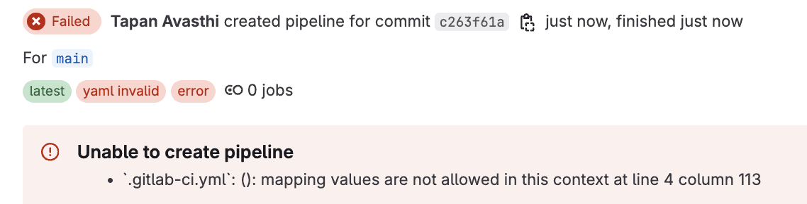
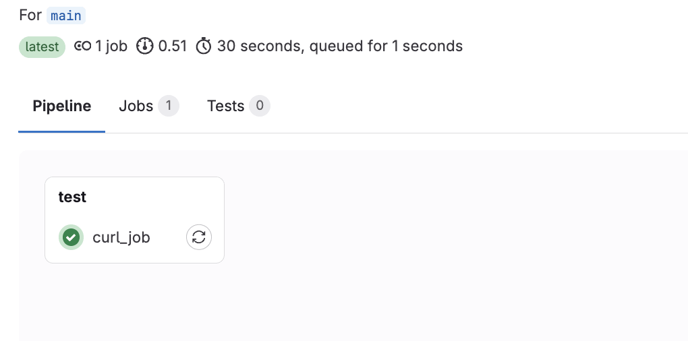
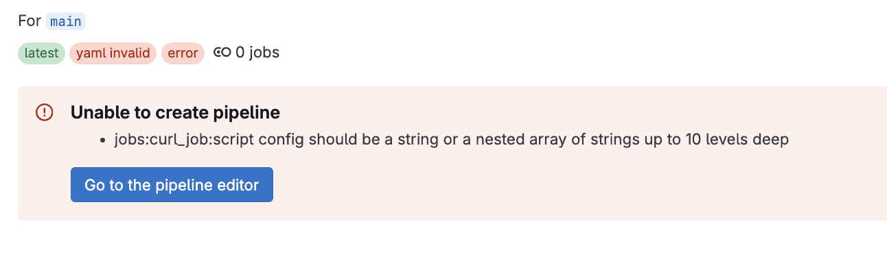
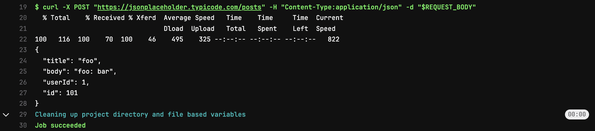
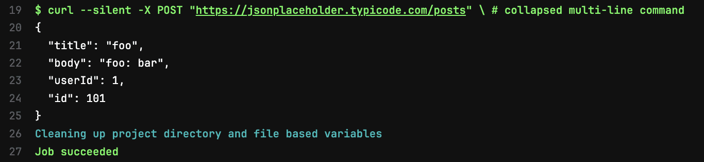
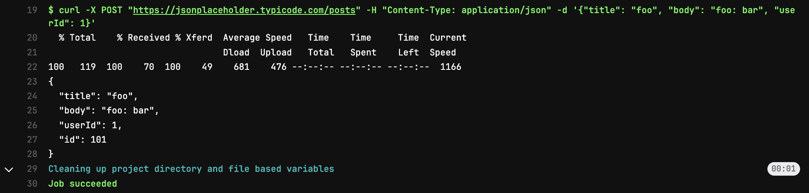

# [在 gitlab-ci.yml 中使用 cURL 的指南](https://www.baeldung.com/ops/curl-gitlab-ci-yml)

Git

GitLab  

1. 概述
    在 GitLab 流水线中，除了触发作业外，每个作业都需要 `script` 标签来执行 shell 命令。大多数情况下，如果某个 shell 命令在 GitLab CI 外运行正常，在流水线中也应该能正常运行。然而，有些在 GitLab 流水线外部环境中运行良好的 [cURL](https://www.baeldung.com/linux/curl-guide) 命令，却可能在 GitLab 环境中失败。

    在本教程中，我们将学习如何在 `.gitlab-ci.yml` 配置文件中正确使用 cURL 命令。

2. .gitlab-ci.yml 中的冒号解析问题
    cURL 命令通常需要使用冒号（:）来发送请求头和请求体中的键值对。在这一部分，我们将了解由于 GitLab runner 对命令字符串的解析方式可能导致的一些问题。

    1. 问题分析
        首先，我们在本地终端中验证我们的 cURL 命令：

        ```bash
        $ curl -X POST "https://jsonplaceholder.typicode.com/posts" \
        -H "Content-Type: application/json" \
        -d '{"title": "foo", "body": "bar", "userId": 1}'
        ```

        结果如预期所示：

        ```json
        {
            "title": "foo",
            "body": "bar",
            "userId": 1,
            "id": 101
        }
        ```

        接下来，将这条 cURL 命令添加到 GitLab 项目的 `.gitlab-ci.yml` 文件中 `curl_job` 作业的 `script` 标签下：

        ```yaml
        curl_job:
        script:
            - curl -X POST "https://jsonplaceholder.typicode.com/posts" -H "Content-Type: application/json" -d '{"title": "foo", "body": "bar", "userId": 1}'
        ```

        最后，我们运行流水线并查看是否正常执行：

        

        不幸的是，流水线执行失败了。当 GitLab 发现存在 `": "` 字符串时，它会将其识别为 YAML 中的键值对分隔符。

    2. 冒号问题的简单修复方法
        我们可以通过移除冒号后的空格来修复 `.gitlab-ci.yml` 中的错误：

        ```yaml
        curl_job:
        script:
            - curl -X POST "https://jsonplaceholder.typicode.com/posts" -H "Content-Type:application/json" -d '{"title":"foo", "body":"bar", "userId":1}'
        ```

        现在我们验证一下流水线是否可以正确运行：

        

        虽然在这个案例中修复有效，但需要注意：**请求体或请求头中可能包含合法的 `": "` 字符串**，此时这种简单修复方式就不再适用。

        让我们模拟这种失败场景，修改请求体内容：

        ```yaml
        curl_job:
        script:
            - curl -X POST "https://jsonplaceholder.typicode.com/posts" -H "Content-Type:application/json" -d '{"title":"foo", "body":"foo: bar", "userId":1}'
        ```

        再次运行 GitLab 流水线：

        

        GitLab 无法创建流水线，因为它认为 `jobs:curl_job:script` 配置格式不正确。

3. 使用 GitLab 变量
    一个更高级的解决方案是使用 [GitLab CI/CD 变量](https://docs.gitlab.com/ee/ci/variables/#define-a-cicd-variable-in-the-gitlab-ciyml-file)。我们可以定义变量来保存包含 `": "` 的字符串，并在作业的 `script` 标签下复用这些变量。

    我们在 `.gitlab-ci.yml` 中为 `curl_job` 定义 `REQUEST_BODY` CI/CD 变量：

    ```yaml
    curl_job:
    variables:
        REQUEST_BODY: '{"title":"foo", "body":"foo: bar", "userId":1}'
    script:
        - curl -X POST "https://jsonplaceholder.typicode.com/posts" -H "Content-Type:application/json" -d "$REQUEST_BODY"
    ```

    在定义变量时，我们使用单引号包裹字符串以保留双引号；引用变量时则使用双引号，确保整个内容作为单个参数传递。

    现在运行最新的 `.gitlab-ci.yml` 配置对应的流水线并查看日志：

    

    完美！这种方法成功解决了问题。

4. 使用多行 YAML 标量
    在这一部分，我们将使用多行 YAML 标量语法来编写 GitLab 作业中的 cURL 命令。

    1. 使用折叠块标量（Folded Block Scalar）
        我们可以使用[折叠块标量符号](https://www.baeldung.com/yaml-multi-line#folded-style) `>` 来添加完整的 cURL 命令。这不仅解决了冒号解析的问题，还提高了可读性，允许将长命令拆分为多行。

        示例配置如下：

        ```yaml
        curl_job:
        variables:
            REQUEST_BODY: '{"title":"foo", "body":"foo: bar", "userId":1}'
        script: >
            curl --silent -X POST "https://jsonplaceholder.typicode.com/posts"
            -H "Content-Type: application/json"
            -d "${REQUEST_BODY}"
        ```

        所有换行都会被转换为空格，因此可以安全地将命令拆分为多行。注意：后续行不能有前导空格，必须与起始行保持相同的缩进级别。

        运行最新配置的流水线并查看日志：

        

        任务成功执行！

    2. 使用字面块标量（Literal Block Scalar）
        另一种方法是使用[字面块标量符号](https://www.baeldung.com/yaml-multi-line#literal-style) `|`，它支持在命令中使用反斜杠 `\` 实现类似 shell 的行继续功能。

        ```yaml
        curl_job:
        script: |
            curl -X POST "https://jsonplaceholder.typicode.com/posts"   \
            -H "Content-Type: application/json" \
            -d '{"title": "foo", "body": "foo: bar", "userId": 1}'
        ```

        通过显式添加 `\`，我们可以在后续行中添加缩进而不会产生副作用。GitLab 会将它们视为同一命令的一部分。

        运行最新的流水线配置并验证：

        

        太棒了！命令按预期执行。

5. 结论
    在本文中，我们探讨了在 `.gitlab-ci.yml` 中使用 cURL 命令时可能遇到的问题。此外，我们还学习了多种解决方案，包括使用 GitLab CI/CD 变量、多行 YAML 标量块等，来避免冒号解析错误并提高代码可读性。
